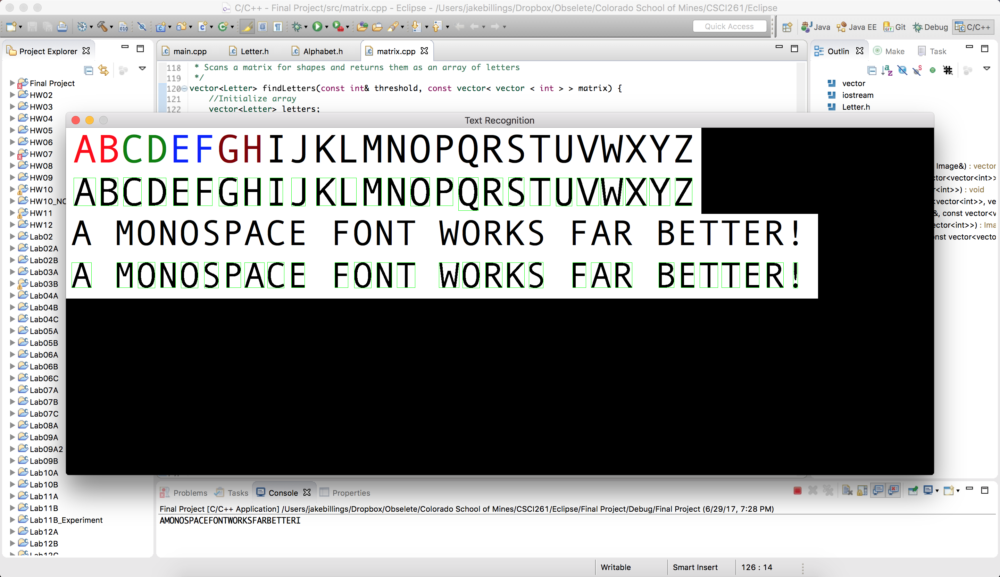

# research-ocr
Originally completed as a final project for CSCI261 via correspondence at Colorado School of Mines, this repository contains a C++ implementation of a simple OCR algorithm based on matrix comparison.

